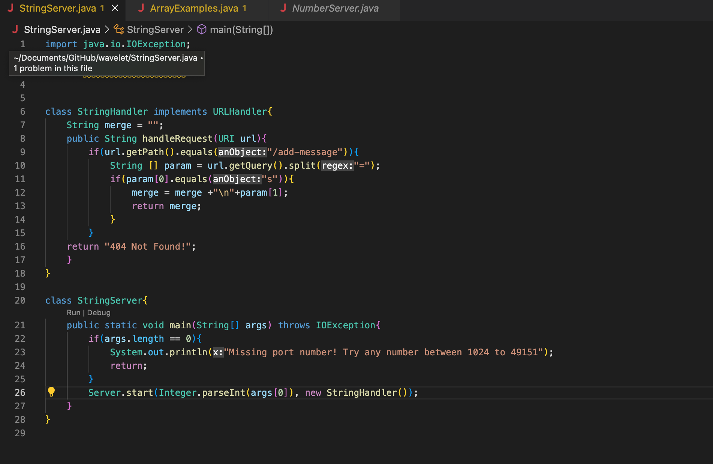

# Lab Report 2

## Part 1

The methods that are called within my code is the handleRequest method. This method takes the message I want the server to return and returns it.

The relevant arguments to those methods are URI url which represents the requested URL and contains the info on its path and query parameters. The values of the relevent fields of the class are String merge which stores the message that is sent and is initialized to an empty string when an instance of the StringHandler class is created. Once the method is called and a new message is recieved, it is appended into 'merge'.

The value of the merge field changes based on the requests of the server. If the URL path matches the url.getPath and contains the url.getQuery, then the merge field changes, updates and returns. However, if the URL path does not match url.getPath or conatin an 's' in the url.getQuery, then the merge field is not updated and will remain unchanged.

The methods that are called within my code is the handleRequest method. This method takes the message I want the server to return and returns it.

The relevant arguments to those methods are URI url which represents the requested URL and contains the info on its path and query parameters. The values of the relevent fields of the class are String merge which stores the message that is sent and is initialized to an empty string when an instance of the StringHandler class is created. Once the method is called and a new message is recieved, it is appended into 'merge'.

The value of the merge field changes based on the requests of the server. If the URL path matches the url.getPath and contains the url.getQuery, then the merge field changes, updates and returns. However, if the URL path does not match url.getPath or conatin an 's' in the url.getQuery, then the merge field is not updated and will remain unchanged.

## Part 2

A failure-inducing input for the buggy program, as a JUnit test and any associated code
~~~
@Test
public void testReversedInPlace2{
  int[] input = { 1, 7, 2};
  ArrayExamples.reverseInPlace(input);
  assertArrayEquals(new Int[] { 2, 7, 1},input)
}

@Test
public void testReversed2{
  int[] input = {1, 3, 5, 9};
  ArrayExamples.reversed(input);
  assertArrayEquals(new Int[] {9, 5, 3, 1},input)
}
~~~

An input that doesn’t induce a failure, as a JUnit test and any associated code 
~~~
@Test
public void testReversedInPlace2{
  int[] input = {1};
  ArrayExamples.reverseInPlace(input);
  assertArrayEquals(new Int[] {1},input)
}

@Test
public void testReversed2{
  int[] input = {1};
  ArrayExamples.reversed(input);
  assertArrayEquals(new Int[] {1},input)
}
~~~

The symptom, as the output of running the tests

The bug, as the before-and-after code change required to fix it 

Before:

~~~
static void reverseInPlace(int[] arr){
  for(int i = 0; i< arr.length; i+=1){
    arr[i] = arr[arr.length - i -1]:
  }
}
~~~

After:
~~~
public class ArrayExamples{
  static void reverseInPlace(int[] arr){
  for (int i = 0; i < arr.length/2; i += 1){
    int temp = arr[i];
    arr[i] = arr[arr.length-i-1];
    arr[arr.length-i-1]= temp;
  }
 }
 static int [] reversed (intI] arr) {
  int[] newArray = new int[arr. length];
  for (int i = 0; i < arr. length/2; 1 += 1) k
    int temp = arr[i]:
    arr[i] = arr[arr.length - i- 1]:
    arr[arr. length- i-1] = temp;
  }
  for (int i = 0; i < arr. length; it=1) {
    newArray[i] = arr[arr.length-i- 1];
  }
  return newArray;
 }
}
~~~

## Part 3

Something that I learned in lab was how big of an impact such a tiny mistake can have on your entire code. For example when working with my group to debug the reverseInPlace method I was suprised to find out that a main reason our array was not getting properly switched was because we were not dividing by 2 in our for loop to only switch half the elements. By dividing by 2 in our method and switching the starting element, we were able to fix the entire output to get our expected outcome.

