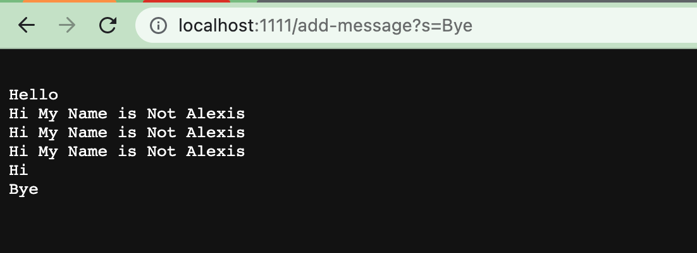
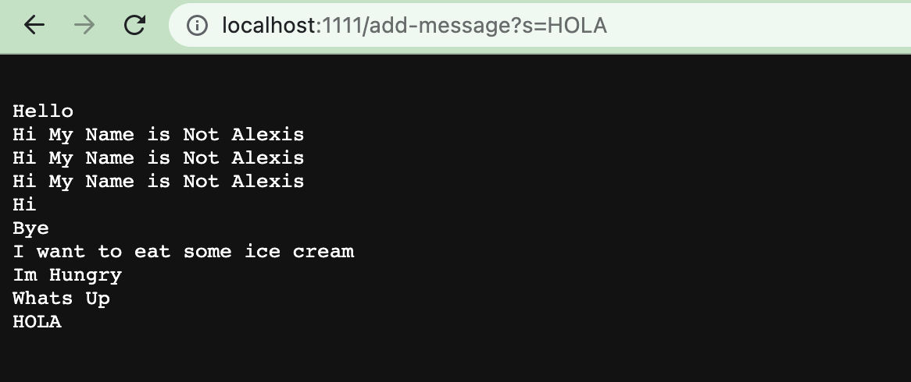

# Lab Report 2

## Part 1

## Part 2

A failure-inducing input for the buggy program, as a JUnit test and any associated code
~~~
@Test
public void testReversedInPlace2{
  int[] input = { 1, 7, 2};
  ArrayExamples.reverseInPlace(input);
  assertArrayEquals(new Int[] { 2, 7, 1},input)
}

@Test
public void testReversed2{
  int[] input = {1, 3, 5, 9};
  ArrayExamples.reversed(input);
  assertArrayEquals(new Int[] {9, 5, 3, 1},input)
}
~~~

An input that doesn’t induce a failure, as a JUnit test and any associated code 
~~~
@Test
public void testReversedInPlace2{
  int[] input = {1};
  ArrayExamples.reverseInPlace(input);
  assertArrayEquals(new Int[] {1},input)
}

@Test
public void testReversed2{
  int[] input = {1};
  ArrayExamples.reversed(input);
  assertArrayEquals(new Int[] {1},input)
}
~~~

The symptom, as the output of running the tests

The bug, as the before-and-after code change required to fix it 

~~~
public class ArrayExamples{
  static void reverseInPlace(int[] arr){
  for (int i = 0; i < arr.length/2; i += 1){
    int temp = arr[i];
    arr[i] = arr[arr.length-i-1];
    arr[arr.length-i-1]= temp;
  }
 }
 static int [] reversed (intI] arr) {
  int[] newArray = new int[arr. length];
  for (int i = 0; i < arr. length/2; 1 += 1) k
    int temp = arr[i]:
    arr[i] = arr[arr.length - i- 1]:
    arr[arr. length- i-1] = temp;
  }
  for (int i = 0; i < arr. length; it=1) {
    newArray[i] = arr[arr.length-i- 1];
  }
  return newArray;
 }
}
~~~

