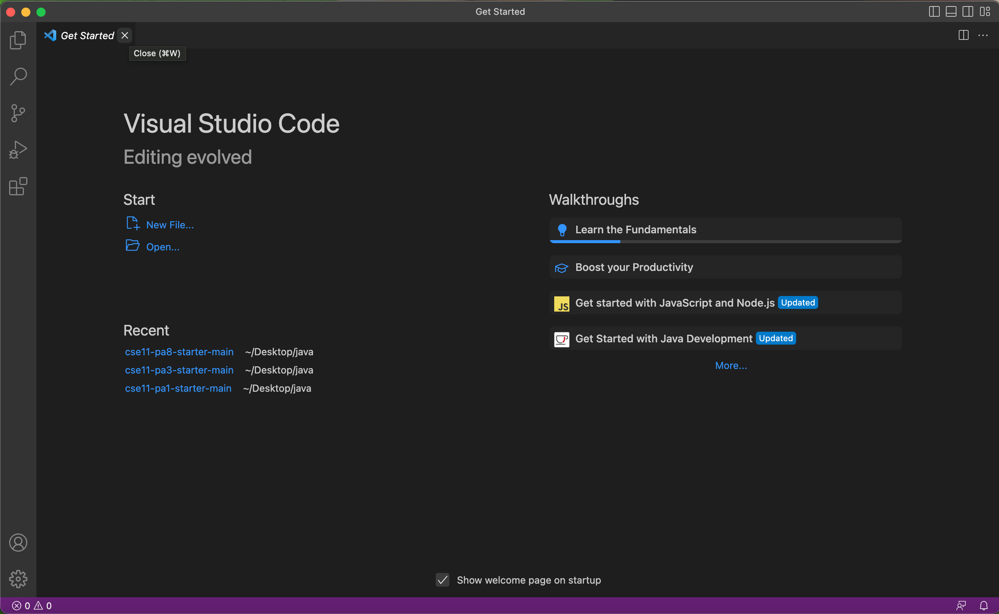
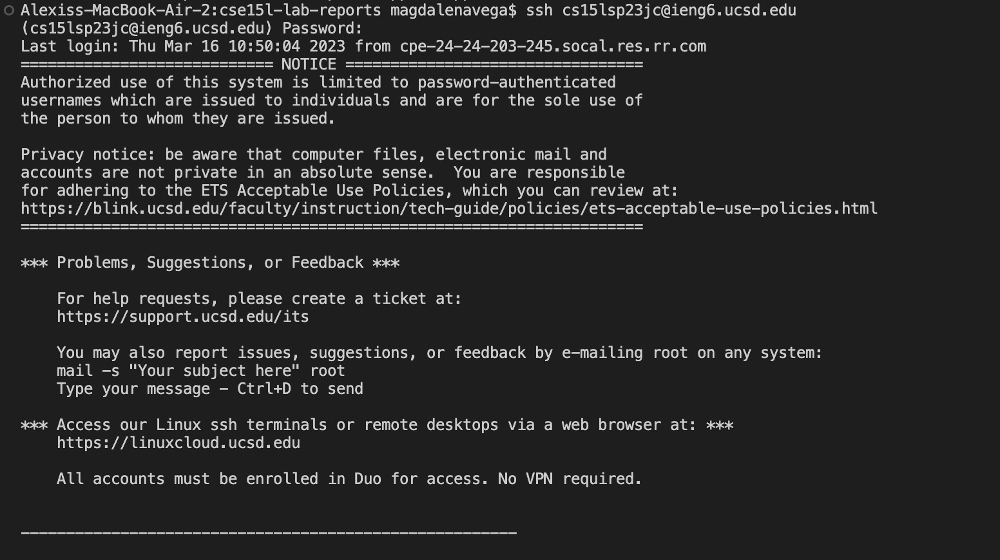
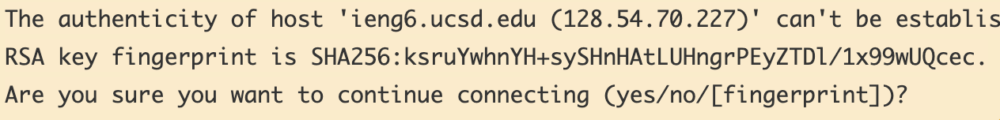
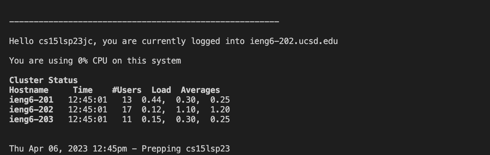
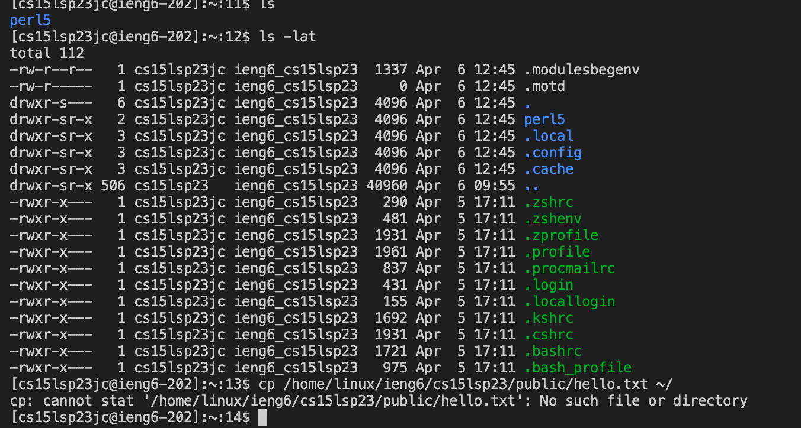

# Lab Report 1

To begin logging in to your course-specified account on ieng6 you will need to begin by installing Visual Studio Code. 
You can use this link [here](https://code.visualstudio.com/) and follow the instructions to download it to your operting system.

Once you have downloaded VScode, you should be able to open a window that looks like this:

To begin connecting you have to open a New Terminal. Within this terminal you will input the following: $ ssh cs15lsp23zz@ieng6.ucsd.edu , substituting the zz with the letters specified in your course specific account (you do not need to include the $ when typing it into your terminal).

Doing the following should produce a message asking you if you want to continue, accept it. 

Accepting by typing yes as well as following the next instruction of entering your password should result in your terminal producing something like this: 

The terminal is now connected to a computer in the CSE basement!

Now that the terminal is connected you are able to run some commands! Running the commands should produce something like this:

The ls command shows you what is inside the directory, the pwd command prints out the working directory and the cat command concatenates the text from the file. The different commands you try will produce different outcomes. So try a bunch and see what happens!

