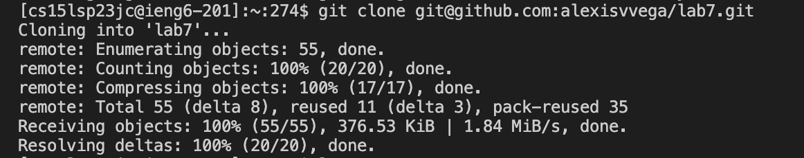
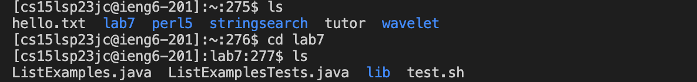

# Lab Report 4

## Step 1: Log into ieng6

To log in you first type your ssh login which should look like this:
~~~
$ ssh cs15lsp23jc@ieng6.ucsd.edu
~~~
press < enter > and input your password.

Doing this should result in the following:

This output provides the information of your last log in and confirms your sucessful log in.

## Step 2: Clone your fork of the repository from your Github account

~~~
$ git clone git@github.com:alexisvvega/lab7.git
~~~

Doing this should produce the following:

## Step 3: Run the tests, demonstrating that they fail

Before running the tests its important to check that you are in the correct directory.

To check enter ls to check the files in your current working directory.
Then cd into lab7 to change the current directory.
Then ls to make sure the files are all correct.

This process should look like this:

After this you enter the following commands:

~~~
$ javac -cp .:lib/hamcrest-core-1.3.jar:lib/junit-4.13.2.jar *.java
$ java -cp .:lib/hamcrest-core-1.3.jar:lib/junit-4.13.2.jar org.junit.runner.JUnitCore ListExamplesTests.java
~~~

  

*cursor was already on index1.
*press x to delete
*press i to insert mode and change
*press 2 
*press esc to get out 
*press :wq to save work
