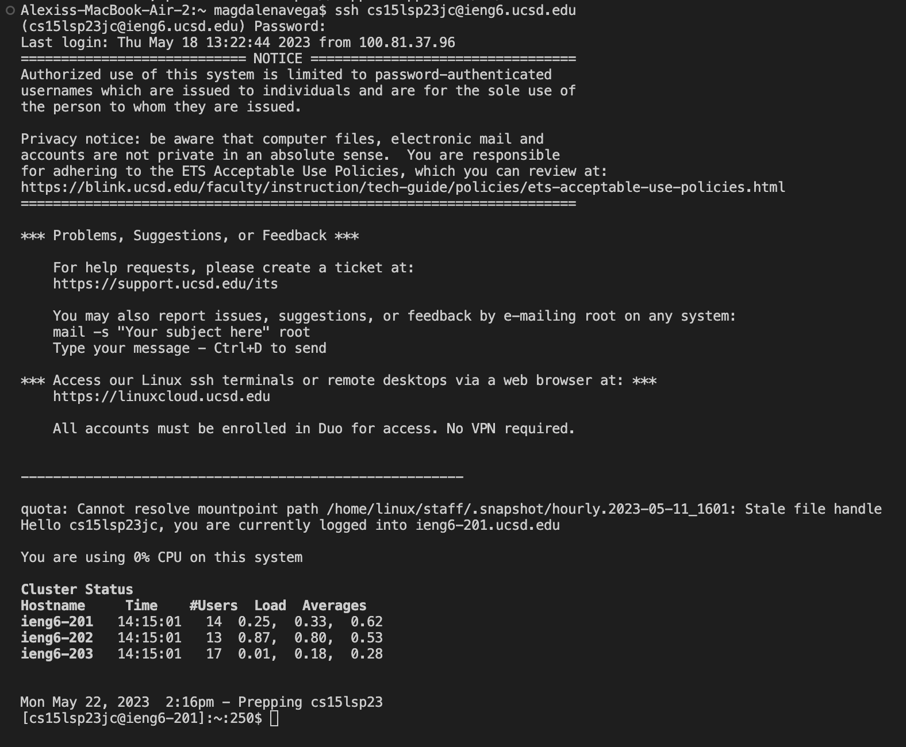

# Lab Report 4

## Step 1: Log into ieng6

To log in you first type your ssh login which should look like this:
~~~
$ ssh cs15lsp23jc@ieng6.ucsd.edu
~~~
press < enter > and input your password.

Doing this should result in the following:

This output provides the information of your last log in and confirms your sucessful log in.

## Step 2: Clone your fork of the repository from your Github account

~~~
$ git clone git@github.com:alexisvvega/lab7.git
~~~

Doing this should produce the following:

  

*cursor was already on index1.
*press x to delete
*press i to insert mode and change
*press 2 
*press esc to get out 
*press :wq to save work
