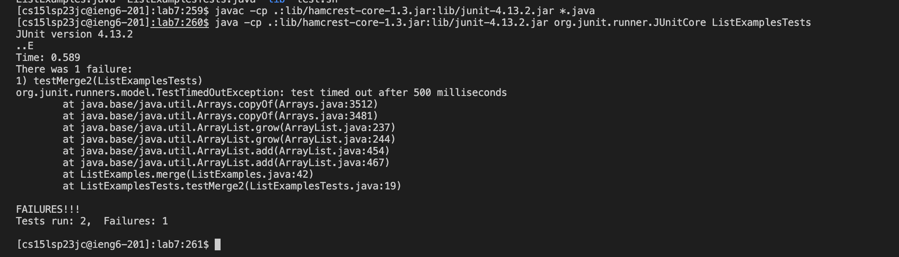
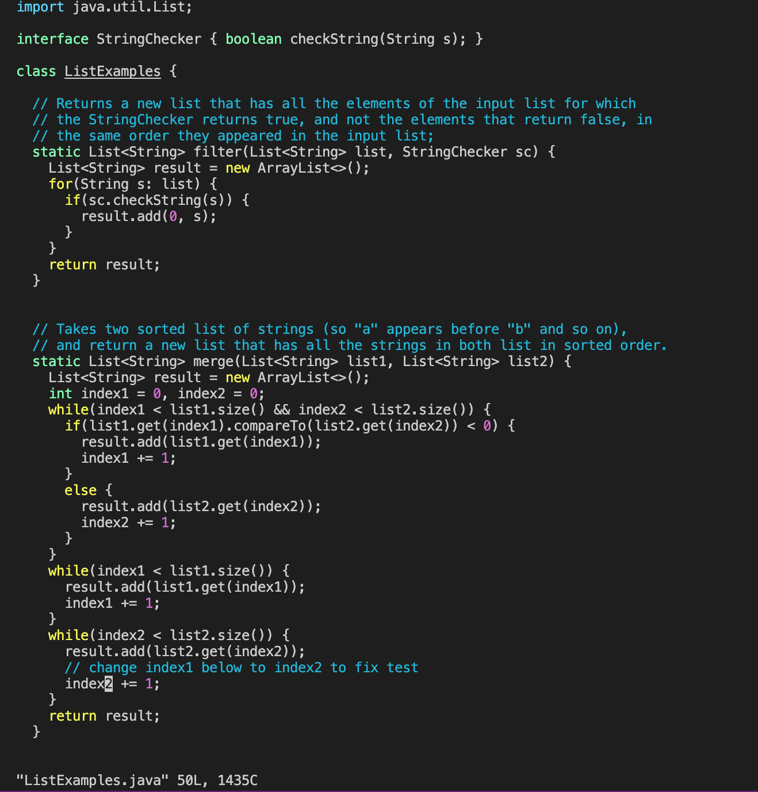
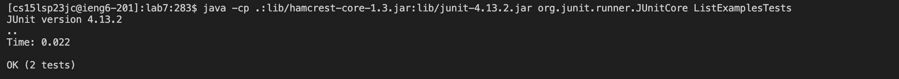
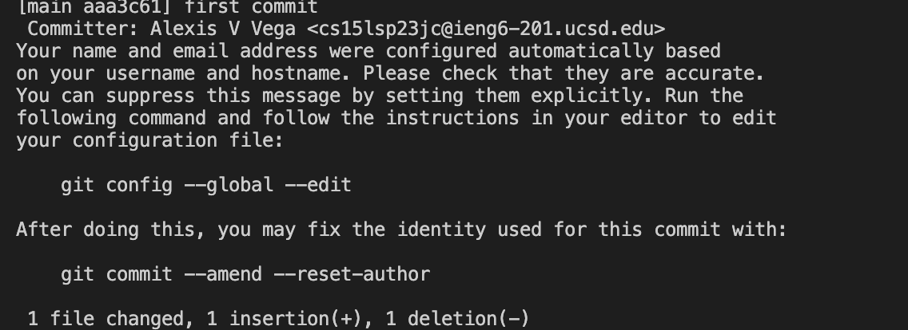
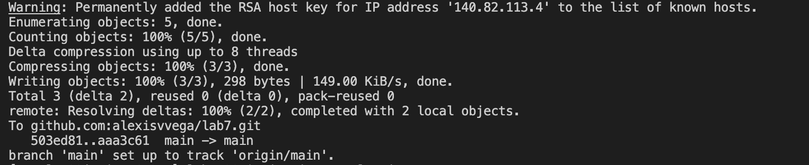

# Lab Report 4

## Step 1: Log into ieng6

To log in you first type your ssh login which should look like this:
~~~
$ ssh cs15lsp23jc@ieng6.ucsd.edu
~~~
press 
```
<enter>
```
and input your password and press 
```
<enter>
```

Doing this should result in the following:


This output provides the information of your last log in and confirms your sucessful log in.

## Step 2: Clone your fork of the repository from your Github account

To do this type git clone and copy and paste the link of the repository from your github account.
(to copy press Command-C and to paste press Command-V)

~~~
$ git clone git@github.com:alexisvvega/lab7.git
~~~
then press 
```
<enter>
```
Doing this should produce the following:


## Step 3: Run the tests, demonstrating that they fail

Before running the tests its important to check that you are in the correct directory.

To check enter ls to check the files in your current working directory.
to do this press:
```
<ls>
```
```
<enter>
```
Then cd into lab7 to change the current directory.
to do this press:
```
<cd lab7>
```
```
<enter>
```
Then ls to make sure the files are all correct.
to do this press:
```
<ls>
```
```
<enter>
```
This process should look like this:
```
[cs15lsp23jc@ieng6-201]:~:275$ ls
hello.txt  lab7  per15  stringsearch  tutor  wavelet
[cs15lsp23jc@ieng6-201]:~:276$ cd lab7
[cs15lsp23jc@ieng6-201]:lab7:277$ ls
ListExamples.java  ListExamplesTests.java  lib  test.sh 
```
After this you enter the following commands:

~~~
$ javac -cp .:lib/hamcrest-core-1.3.jar:lib/junit-4.13.2.jar *.java
~~~
press 
```
<enter>
```
~~~
$ java -cp .:lib/hamcrest-core-1.3.jar:lib/junit-4.13.2.jar org.junit.runner.JUnitCore ListExamplesTests.java
~~~
press 
```
<enter>
```

I got these commands by pressing
```
<up>
```
```
<up>
```
```
<enter>
```
and then 
```
<up>
```
```
<up>
```
```
<up>
```
```
<enter>
```
(the command was 2 up and 3 up in the search history, so I used up arrow to access it)


This will produce the following:



This shows all the failing tests.

## Step 4: Edit the code file to fix the failing test

To fix the failures you will need to edit the code file. 

To edit enter:

~~~
$ vim ListExamples.java
~~~
 
Doing this should take you to the code where you will edit it to fix the failures.
To fix the failures you will have to change index1 to be index2.
For me the cursor was already on index1 and I did not have to search for it.
(If your cursor was not already on the desired place you could type < /index1 > and press < n > 9 times.)
After this I pressed
```
<x>
```
to delete the 1.
Pressed
```
<i>
```
to enter insert mode and edit the 1 into a 2 
Then you press
```
<esc>
```
to exit insert mode.
And finally enter 
```
<:wq>
```
```
<enter>
```
to save all changes and exit.

The fixed code should look like this: 



## Step 5: Run the tests, demonstrating that they now succeed

Running the commands again: 

~~~
$ javac -cp .:lib/hamcrest-core-1.3.jar:lib/junit-4.13.2.jar *.java
~~~
```
<enter>
```
~~~
$ java -cp .:lib/hamcrest-core-1.3.jar:lib/junit-4.13.2.jar org.junit.runner.JUnitCore ListExamplesTests.java
~~~
```
<enter>
```

should now produce the following: 



## Step 6: Commit and push the resulting change to your Github account (you can pick any commit message!)

Now that the code is fixed we are able to commit and push.

To do this you need to enter the following into your terminal:

~~~
$ git add ListExamples.java
~~~
```
<enter>
```
~~~
$ git commit -m 'first commit'
~~~
```
<enter>
```

Doing this will produce this message: 



After this you need to also enter: 

~~~
$ git push -u origin main
~~~
```
<enter>
```

Which will produce the following: 



The changes have been succesfully made and pushed into github.


