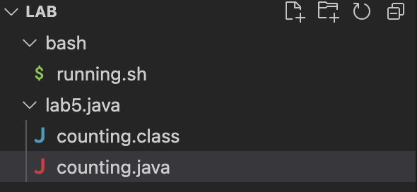

## Part 1 – Debugging Scenario
What environment are you using (computer, operating system, web browser, terminal/editor, and so on)?

Hello I am using a MacBook Air on Visual Studio Code and I am trying to run my counting.java file. This file counts to 10 and adds the sum of the numbers as well as printing out messages while it runs. I was able to create my ```counting.java``` file by using a bash script named ```running.java``` which compiles and runs ```counitng.java```. I am running this on my terminal by using javac ```counting.java``` and java counting

Detail the symptom you're seeing. Be specific; include both what you're seeing and what you expected to see instead. Screenshots are great, copy-pasted terminal output is also great. Avoid saying “it doesn't work”. 

My file ```counting.java``` should count from 1 to 10 and add the sum of the numbers as well as print out messages while it runs. I am expecting to see the sum of numbers 1 through 10 which should be 55 but instead I am getting the total numbers counted, 10. Currently my bashscript looks like this: 
```
#!/bin/bash

# Compile Java code
javac counting.java

# Check if compilation was successful
if [ $? -eq 0 ]; then
    echo "Java code compiled successfully."

    # Run Java program
    java counting
else
    echo "Compilation failed. Please check your Java code."
fi
```
and my java file looks like this: 
```
public class counting {
    public static void main(String[] args) {
        System.out.println("Let's count from 1 to 10 and calculate the sum!");

        int sum = 0;
        for (int i = 1; i <= 10; i++) {
            System.out.println(i);
            sum += 1;
        }
        System.out.println("\nCounting complete!");
        System.out.println("The sum of the numbers is: " + sum);
        System.out.println("Have a great day!");
    }
}
```
However my terminal is currently producing this: 
```
Alexiss-MacBook-Air-2:lab5.java magdalenavega$ java counting
Let's count from 1 to 10 and calculate the sum!
1
2
3
4
5
6
7
8
9
10

Counting complete!
The sum of the numbers is: 10
Have a great day!
```
The output should say ```The sum of the numbers is: 55``` however it is saying ```The sum of the numbers is: 10``` and I am not sure why.

Detail the failure-inducing input and context. That might mean any or all of the command you're running, a test case, command-line arguments, working directory, even the last few commands you ran. Do your best to provide as much context as you can.

I know that in order to run the terminal I need to make sure that I am in the correct directory so I did:
```
Alexiss-MacBook-Air-2:lab magdalenavega$ ls
bash            lab5.java
Alexiss-MacBook-Air-2:lab magdalenavega$ cd lab5.java
```
and then I ran the following: 
```
Alexiss-MacBook-Air-2:lab5.java magdalenavega$ javac counting.java
Alexiss-MacBook-Air-2:lab5.java magdalenavega$ java counting
```
which produced the following:
```
Let's count from 1 to 10 and calculate the sum!
1
2
3
4
5
6
7
8
9
10

Counting complete!
The sum of the numbers is: 10
Have a great day!
```
This is what my folders and files look like as well: 



## Part 2 – Reflection
During the second half of the quarter, I learned about vim and its various commands and features. Vim is a text editor that has a wide range of functionalities and modes such as normal, insert and visual. Within these modes there are many cool features and navigation techniques through the use of your keys on your keyboard. 
~~~
h
~~~
moves your cursor to the left one line
~~~
l
~~~
moves your cursor to the right one line 
~~~
j
~~~
moves your cursor down one line
~~~
k
~~~
moves your cursor up one line
~~~
x
~~~
deletes what your cursor is on
~~~
:wq
~~~
saves your edits and quits
Those are some of the many features I was able to learn through vim and it was one of the most interesting subjects we discussed. Walking through the tutorial on our terminal was really fun and was what made me learn it the best, making it my favorite topic discussed second half of the quarter.

